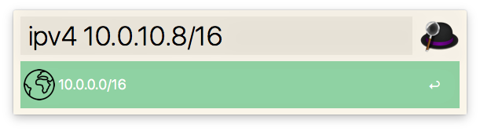

# Alfred IPv4 Network Workflow



## Install

Download and double-click.

- https://github.com/lorentzca/alfred-ipv4-network-workflow/releases/latest

## Usage

Get IPv4 Network Address from CIDR.

```
ipv4 <CIDR>
```
